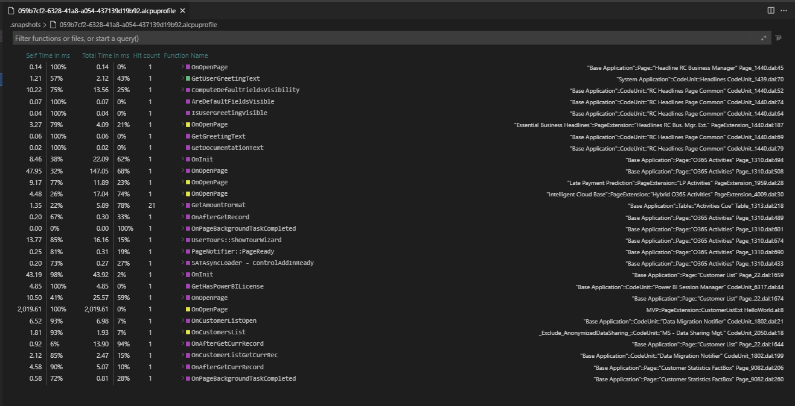

# AL Profiler Overview

With the AL Profiler for [!INCLUDE[d365al_ext_md](../includes/d365al_ext_md.md)] you can capture a performance profile of the code that was executed for a snapshot. Using the performance profiling editor view in Visual Studio Code, you can investigate the time spent on execution, either using top-down and bottom-up call stack views, or by using flame graphs. <!-- is this in? -->

The AL profiler works on a snapshot of running code. Snapshot debugging is a recording of running code that allows for later offline inspection. For more information, see [Snapshot Debugging](devenv-snapshot-debugging.md). 

## Snapshot setting

In order to do profiling on code, you must first capture a snapshot of running code. The snapshot configuration must include a parameter called  `executionContext` which has the following values in the table below.

|Option|Description|
|------|-----------|
|`Debug` | The snapshot session will not gather profile information.| 
|`Profile` | The snapshot session will only gather profile information, snappoints will be ignored, and debugging will not work.|
|`DebugAndProfile` | Both debugging and profiling will be available as a result of a snapshot session.|

This means that the configuration for the snapshot in the `launch.json` file, if we want to use it both for debugging and profiling purposes, will look equivalent to the following:

```al
"configurations": [ 
        {
            "name": "snapshotInitialize: Your own server",
            "type": "al",
            "userId": "555",
            "request": "snapshotInitialize",
            "environmentType": "OnPrem",
            "server": "http://localserver",
            "serverInstance": "BC190",
            "authentication": "Windows",
            "breakOnNext": "WebClient",
            "executionContext": "DebugAndProfile"
        },
    ...
```

Then, when the snapshot file is downloaded, you can generate a profile file, based on the snapshot by using the **AL: Generate profile file** option.

The profile file for AL code has the extension `.alcpuprofile` and when you open the file, it displays in the performance profiling editor view in Visual Studio Code.

## Graph of method calls

To investigate the graph of method calls, you open the generated profile file in the performance profiling editor. If you click the file directly, it opens up in a default view. You can also right-click a profile file and get the following options: **AL Profile Visualizer TopDown Graph** and **AL Profile Visualizer BottomUp Graph**. When the the profile file opens, it looks similar to the illustration below:



To investigate the data shown in the graph, you can use different view modes as described in the next section. Choose a specific method to navigate to the code. The color legend of the graph is the following:

|Color|Layer|
|-----|-----|
|Teal |System|
|Purple| Base|
|Yellow| Other|

### View modes

To switch between views, you can either right-click the profile file and choose a view, or you can use the small button in the upper right corner. There are two different view modes of the graph; *top-down* and *bottom-up*.

When sorting the stack *top-down*, the graph sorts the methods according to call sequence, which means that the child nodes are the methods called from the parent node. And when sorting *bottom-up*, the graph is sorted as a reverse call stack, which means that the child nodes are methods who called the parent node.

### Details

To investigate further, the **Self-time** and **Total time** columns are important indicators of where time is spent in the code. The **Self-time** is the amount of time spent in the method only, excluding any calls out of the method. The **Total time** is the amount of **Self-time** *plus* any calls out of the method. 

**Hit count** shows the number of times a specific method was called. Time spent is aggregated.

### Filtering

The nodes in the graph can be filtered. The syntax is the following:

`@column name | alias> <op> <value> where `<br> 
`<column name> := [function, url, path, selfTime, totalTime, id, objectType, objectName, declaringApplication]`

#### Column name aliases

The aliases that are available for the column names are:

`<alias> := [f, u, p, s, t, id, ot, on, da]`  
`<op> := [numeric operators, boolean operators, string operators]`  
`numeric operators : [:, =, >, <, <=, >=, <>, !=]`  
`: := equal`  
`boolean operators : [:, =, <>, !=]`  
`string operators : [:, =, !=, <>, ~, =]`  
`~ = := <regex>`

## Inline CodeLens for AL profiling results

CodeLens for Visual Studio Code is enabled in the user or workspace settings by adding the `"editor.codeLens": true` setting for the specific user or for the workspace. CodeLens is also available for showing profile results. At hover, CodeLens displays time spent in milliseconds for the specific method, and number of hits. The option for adding a lower limit for time spent on statement execution is `al.statementLensMin`. To activate this setting, press **Ctrl+Shift+P**, and then choose **Preferences: Open Settings (UI)** for workspace settings, or choose **Preferences: Open User Settings** for user settings.

## See Also

[Snapshot Debugging](devenv-snapshot-debugging.md)  
[AL Language Extension Configuration](devenv-al-extension-configuration.md)