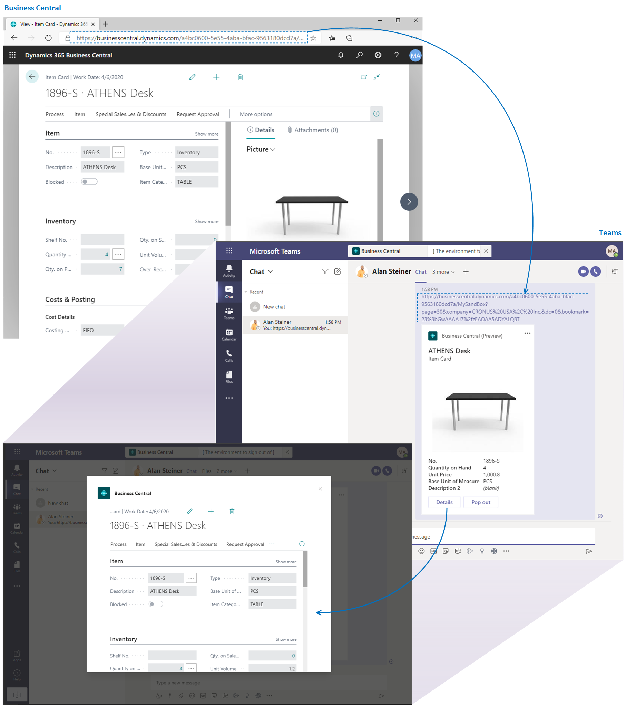

# Developing Pages and Tables for Microsoft Teams Integration

[!INCLUDE [team_preview](includes/teams_preview.md)]

[Microsoft Teams](https://www.microsoft.com/en-us/microsoft-365/microsoft-teams) is a Microsoft 365 product that lets you meet, chat, call, and collaborate with people you work with. [!INCLUDE [prod_short](includes/prod_short.md)] offers an app that connects Teams to your business data in [!INCLUDE [prod_short](includes/prod_short.md)] so users can quickly share details across team members and respond faster to inquiries. In this article, you'll learn how you can develop pages and tables so that data appears in Teams as you want. 

## Introduction to the Business Central app for Teams

In short, the app lets users:

- Copy a link to any Business Central record and paste it into Teams conversation to share with your coworkers. In Teams, the link will expand that into a compact card that displays a defined set of fields about the record.
- From the card in teams, users can select a button to view more details about the record. The card opens into window inside Teams that includes FactBoxes and other embedded content, such as charts. With the proper permissions, anyone in the conversation can edit fields, start workflows, and take action from the window - without having to switch from Teams.

## Managing, Installing, and Using the Business Central App for Teams

For more details about installing and using the [!INCLUDE [prod_short](includes/prod_short.md)] app in Teams from an admin and user perspective, see [Business Central and Microsoft Teams Integration](/dynamics365/business-central/across-teams-overview).

## Development overview

Users can choose which links to records are pasted into Teams. The pasted links are then displayed as cards. As a developer, you can choose which fields are shown on the card, and the look and behavior of the card details.

### About cards

The [!INCLUDE [prod_short](includes/prod_short.md)] app for Teams is designed to work with entity pages that represent a single record. More specifically, it's designed for Card, Document, or ListPlus pages. Teams is ready to work with links to these page types and the underlying data in the source tables. 
In most cases, displaying a card in Teams requires no additional development effort. But if a card doesn't display the fields and data you want, you have a couple options in AL code for making changes:

-  Use a field group control on the source table

    This method primarily involves using the `Brick` field group on the page's source table.

- Use Teams-specific events

    There are currently two events that you can code against to change the fields that display in the card at runtime. We recommend that you use these events as an additive measure.

In most cases, we recommend you set the `Brick` field group instead of using events to define card content. Using the `Brick` field group ensures a consistent experience across the Business Central Web client, mobile devices, and Teams. If a table doesn't include a `Brick` field group, you should add one, then use the events to change the fields as needed.

For more information about these two development options, see [Extending Teams Cards](devenv-develop-for-teams-cards.md).

### About card details

Users can select the **Details** button on a Teams card to drill into the details of the card. This button opens the [!INCLUDE [webclient](includes/webclient.md)] in a window that's embedded inside Teams. The window displays the target page object. The page includes any extensions to the page and its source table, role customizations, and user personalization. The experience is nearly identical to that of displaying the same record in the [!INCLUDE [webclient](includes/webclient.md)], except with some minor client differences.

You can modify or extend the layout and behavior of the page, like you would any page. The changes you make will affect the page in all [!INCLUDE [prod_short](includes/prod_short.md)] clients, not just in Teams. You can't implement functionality that is available only in Teams but not other [!INCLUDE [prod_short](includes/prod_short.md)] clients. For more information about implementing pages, see [Pages Overview](devenv-pages-overview.md).

## Preparing your environment for development and testing

Developing for Teams integration is similar to other development activities in [!INCLUDE [prod_short](includes/prod_short.md)]. It requires Visual Studio Code, installed with the AL language extension, and knowledge of the AL language. However, because the [!INCLUDE [prod_short](includes/prod_short.md)] app for Teams only supports [!INCLUDE [prod_short](includes/prod_short.md)] online, you must deploy your extensions to an online sandbox to test the implementation. For more information about sandboxes, see [Sandbox Environments for Dynamics 365 Business Central Development](devenv-sandbox-overview.md).

## See Also
[FAQ for Teams Integration](devenv-dev-faq-teams.md)  
[Field Groups](devenv-field-groups.md)  
[Designing List Pages](devenv-designing-list-pages.md)  
[Working With Media on Records](devenv-working-with-media-on-records.md)  
