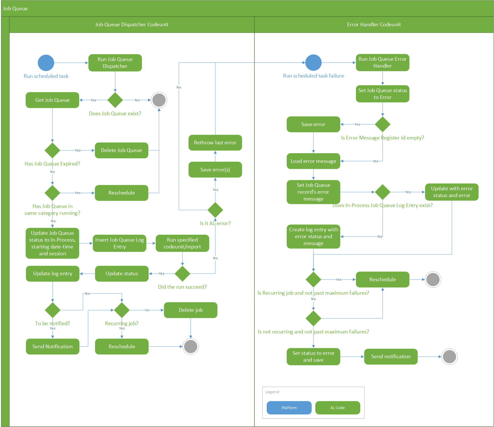

# Job Queue
This article describes how the job queue works in [!INCLUDE[prod_short](includes/prod_short.md)] so that you can....

Behind the scenes, the job queue uses the task scheduler from the platform. For more information about task scheduler, see [Task Scheduler](devenv-task-scheduler.md).

## Job queue flow

The following diagram illustrates the flow of the job queue:

## Create and manage job queue

A job queue is basically an abstraction using task scheduler to enable end users to view, create, or modify jobs that are set to run in the background. These jobs can be set to run on a recurring schedule.

.. Add some examples

## How job queue works

This section describes the flow that a job queue goes through.

### General flow

A job is run when the task scheduler's task is run. For more information, see [Task Scheduler](devenv-task-scheduler.md).

Here's a general overview of the process:

1. When a job queue is created and set to ready state, a Scheduled Task is created to run not before the "Earliest Start Date/Time".
2. When the scheduled task is picked up by the task scheduler to run, a new background session is started.
3. The background session will run the **Job Queue Dispatcher** codeunit:
    1. It will firstly check if the job should run or reschedule.
        If it should not run, it will delete itself or reschedule in the case of a already running "Category Code"
    2. The Job Queue Entry will be updated to "In-Progress" state and a Job Queue Log Entry will be created.
    3. The specified "Object ID to Run" will then be started.
        - In the event of an exception, none of the subsequent steps will run and the failure codeunit path will run.
4. The failure codeunit path:
    1. An exception is raised and surfaced.
    2. The **Job Queue Error Handler** codeunit will run in a new background session.
        1. It will update the Job Queue Entry to error state.
        2. Save the error(s) using "Error Message Management".
        3. Update the Job Queue Entry and Job Queue Log Entry with the error.
        4. The job queue will then either stay in Error state or be rescheduled.
            - The job queue will stay in error state if the "Maximum No. of Attempts" has been exceeded and isn't a recurring job.
            - If the maximum attempts have not been exceeded and is a recurring job, it will be rescheduled.

## About job queue sessions and permissions
The session runs using the same user/credentials that are used when calling AL code. The user that is used is the user that sets the job to ready state. The user must have appropriate permissions to run the job queue and any other objects that are associated with the operation of the specified object.

## Monitor and troubleshoot

Business Central offers two ways to monitor the flow of job queues: Azure Application Insights and the Session Event table.
These tools let you follow the execution of a job and investigate errors in failure codeunits.

### Application Insights

You can set up Business Central to send telemetry traces to an Application Insights resource in Azure. Once set up, telemetry data will be sent to the resource as job queue moves through the flow. For more information, see:
... Insert links (same as Task Scheduler doc page)

### Session Event Table
From the Business Central web client, you can open the Session Events table by adding `table=2000000111` to the URL. For example: https://businesscentral.dynamics.com/?table=2000000111.

## See Also
[Task Scheduler Data Type](methods-auto/taskscheduler/taskscheduler-data-type.md)   
[Developing Extensions](devenv-dev-overview.md)  
[Getting Started with AL](devenv-get-started.md) 